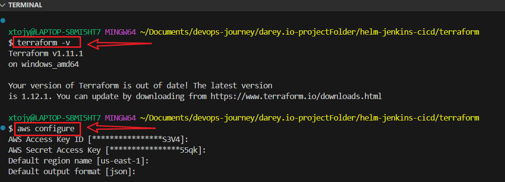
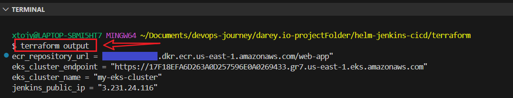
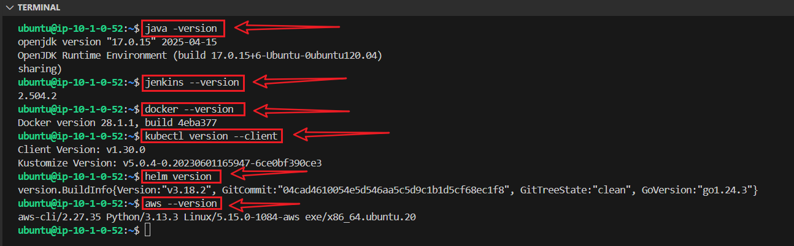
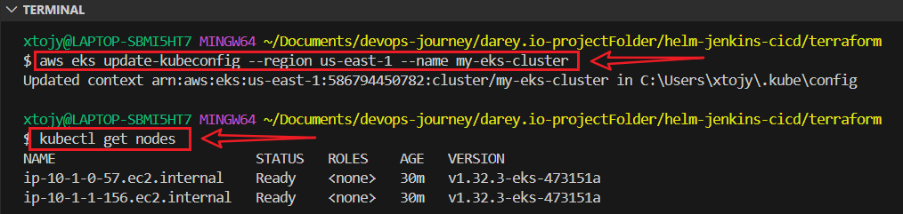
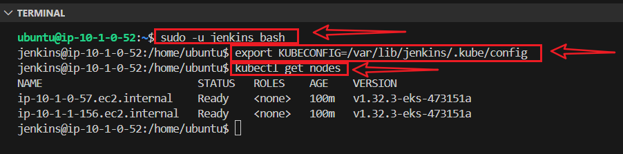
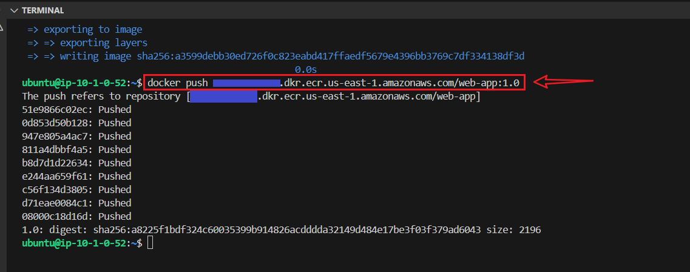
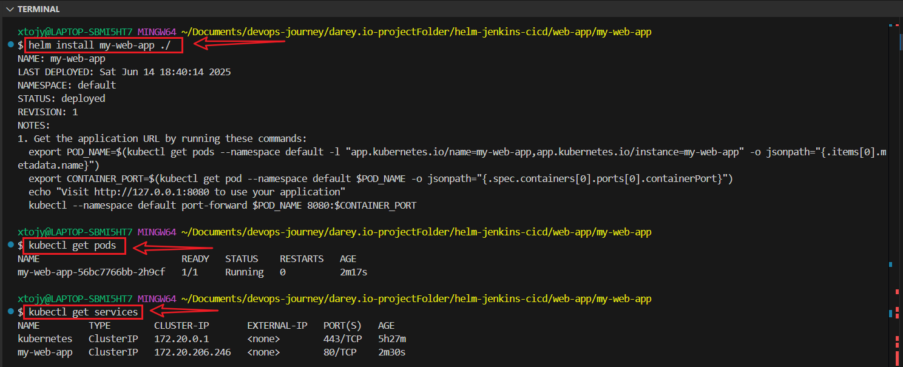
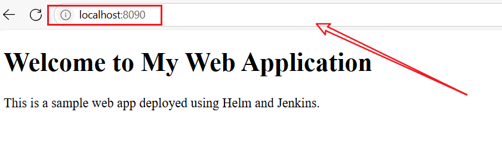
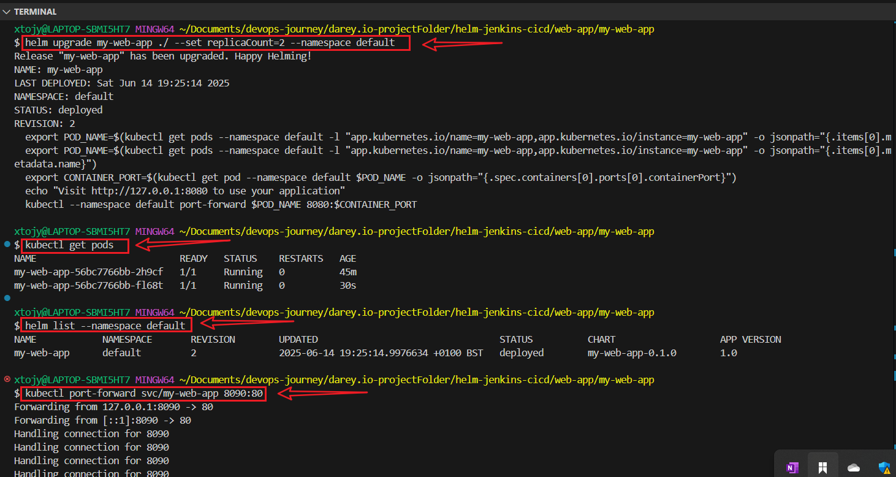
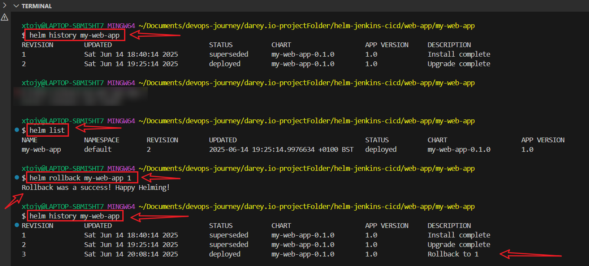

# Configuration Management With Helm and Jenkins CI/CD Pipeline

## Objective

>To design and implement a simplified CI/CD pipeline using Jenkins and Helm charts to automate the deployment of a basic web application (serving an index.html page) on AWS EKS. The infrastructure will be provisioned using Terraform, including an EC2 instance for Jenkins, an ECR repository for Docker images, and an EKS cluster for Kubernetes deployment.

---


## Tools:

+ **AWS:** EC2 (for Jenkins), EKS (Kubernetes cluster), ECR (Docker registry)

+ **Terraform:** Infrastructure provisioning

+ **Jenkins:** CI/CD pipeline

+ **Helm:** Kubernetes package management

+ **Docker:** Containerization

+ **Kubernetes:** Orchestration via EKS


## Prerequisites:

+ AWS account with programmatic access (AWS Access Key and Secret Access Key)

+ Terraform installed locally (terraform CLI)

+ Docker installed locally for building images

+ kubectl installed for interacting with EKS

+ helm CLI installed

+ Basic understanding of Linux commands

+ AWS CLI installed and configured (aws configure)


## Architecture

```
+----------------+      +------------------+      +--------------------+
|   Developer    | ---> |   GitHub Repo    | ---> |   Jenkins EC2 VM   |
+----------------+      +------------------+      +---------+----------+
                                                     |
                                                     v
                                              Docker Build + Push
                                                to Amazon ECR
                                                     |
                                                     v
                                             Helm Deploy to EKS
                                                     |
                                                     v
                                               App Live on EKS

```

---


## Infrastructure Setup with Terraform

- I used Terraform to provision:

- An EC2 instance for Jenkins

- An EKS cluster for Kubernetes

- An ECR repository for Docker images

- A VPC with public subnets
---


## Create User Data Script

+ Create a user_data.sh script that installs:

+ **Jenkins:** For the CI/CD server.

+ **Docker:** For building and pushing images.

+ **kubectl:** For interacting with the EKS cluster.

+ **Helm:** For managing Helm charts.


## Project Structure
```
helm-jenkins-cicd/
├── terraform/
│   ├── main.tf
│   ├── variables.tf
│   ├── outputs.tf
│   ├── provider.tf
│   ├── user_data.sh
├── web-app/
│   ├── .gitignore
│   ├── .dockerignore
│   ├── index.html
│   ├── Dockerfile
│   ├── my-web-app/
│   │   ├── Chart.yaml
│   │   ├── values.yaml
│   │   ├── .helmignore
│   │   ├── templates/
│   │   │   ├── deployment.yaml
│   │   │   ├── service.yaml
│   │   │   ├── ingress.yaml
│   └── Jenkinsfile
```

---


## Step 1: Create Terraform Configuration Files

+ Create a project directory and set up the Terraform files.

```
mkdir helm-jenkins-cicd
cd helm-jenkins-cicd
mkdir terraform
cd terraform
touch main.tf  outputs.tf  provider.tf  variables.tf
touch user_data.sh
```



### terraform/provider.tf

```
provider "aws" {
  region = var.aws_region
}
```

### terraform/variable.tf

```
variable "aws_region" {
  description = "AWS region"
  default     = "us-east-1"
}

variable "instance_type" {
  description = "EC2 instance type for Jenkins"
  default     = "t2.medium"
}

variable "cluster_name" {
  description = "EKS cluster name"
  default     = "my-eks-cluster"
}
```


### terraform/main.tf

```
# VPC
resource "aws_vpc" "main" {
  cidr_block = "10.0.0.0/16"
  tags = {
    Name = "jenkins-eks-vpc"
  }
}

# Subnets
resource "aws_subnet" "public" {
  count                   = 2
  vpc_id                  = aws_vpc.main.id
  cidr_block              = "10.0.${count.index}.0/24"
  availability_zone       = data.aws_availability_zones.available.names[count.index]
  map_public_ip_on_launch = true
  tags = {
    Name = "public-subnet-${count.index}"
  }
}

# Internet Gateway
resource "aws_internet_gateway" "gw" {
  vpc_id = aws_vpc.main.id
}

# Route Table
resource "aws_route_table" "public" {
  vpc_id = aws_vpc.main.id
  route {
    cidr_block = "0.0.0.0/0"
    gateway_id = aws_internet_gateway.gw.id
  }
}

resource "aws_route_table_association" "public" {
  count          = 2
  subnet_id      = aws_subnet.public[count.index].id
  route_table_id = aws_route_table.public.id
}

# Security Group for EC2 (Jenkins)
resource "aws_security_group" "jenkins_sg" {
  vpc_id = aws_vpc.main.id
  ingress {
    from_port   = 8080
    to_port     = 8080
    protocol    = "tcp"
    cidr_blocks = ["0.0.0.0/0"]
  }
  ingress {
    from_port   = 80
    to_port     = 80
    protocol    = "tcp"
    cidr_blocks = ["0.0.0.0/0"]
  }
  ingress {
    from_port   = 22
    to_port     = 22
    protocol    = "tcp"
    cidr_blocks = ["0.0.0.0/0"]
  }
  egress {
    from_port   = 0
    to_port     = 0
    protocol    = "-1"
    cidr_blocks = ["0.0.0.0/0"]
  }
  tags = {
    Name = "jenkins-sg"
  }
}

# EC2 Instance for Jenkins
resource "aws_instance" "jenkins" {
  ami           = data.aws_ami.ubuntu.id
  instance_type = var.instance_type
  subnet_id     = aws_subnet.public[0].id
  security_groups = [aws_security_group.jenkins_sg.id]
  user_data = file("${path.module}/user_data.sh")
  tags = {
    Name = "Jenkins-Server"
  }
}

# ECR Repository
resource "aws_ecr_repository" "web_app" {
  name = "web-app"
}

# EKS Cluster
resource "aws_eks_cluster" "cluster" {
  name     = var.cluster_name
  role_arn = aws_iam_role.eks_cluster.arn
  vpc_config {
    subnet_ids = aws_subnet.public[*].id
  }
}

# IAM Role for EKS Cluster
resource "aws_iam_role" "eks_cluster" {
  name = "eks-cluster-role"
  assume_role_policy = jsonencode({
    Version = "2012-10-17"
    Statement = [
      {
        Action = "sts:AssumeRole"
        Effect = "Allow"
        Principal = {
          Service = "eks.amazonaws.com"
        }
      }
    ]
  })
}

resource "aws_iam_role_policy_attachment" "eks_cluster_policy" {
  policy_arn = "arn:aws:iam::aws:policy/AmazonEKSClusterPolicy"
  role       = aws_iam_role.eks_cluster.name
}

# EKS Node Group
resource "aws_eks_node_group" "nodes" {
  cluster_name    = aws_eks_cluster.cluster.name
  node_group_name = "my-nodes"
  node_role_arn   = aws_iam_role.eks_nodes.arn
  subnet_ids      = aws_subnet.public[*].id
  scaling_config {
    desired_size = 2
    max_size     = 3
    min_size     = 1
  }
}

# IAM Role for EKS Nodes
resource "aws_iam_role" "eks_nodes" {
  name = "eks-nodes-role"
  assume_role_policy = jsonencode({
    Version = "2012-10-17"
    Statement = [
      {
        Action = "sts:AssumeRole"
        Effect = "Allow"
        Principal = {
          Service = "ec2.amazonaws.com"
        }
      }
    ]
  })
}

resource "aws_iam_role_policy_attachment" "eks_worker_node_policy" {
  policy_arn = "arn:aws:iam::aws:policy/AmazonEKSWorkerNodePolicy"
  role       = aws_iam_role.eks_nodes.name
}

resource "aws_iam_role_policy_attachment" "eks_cni_policy" {
  policy_arn = "arn:aws:iam::aws:policy/AmazonEKS_CNI_Policy"
  role       = aws_iam_role.eks_nodes.name
}

resource "aws_iam_role_policy_attachment" "ecr_read_only" {
  policy_arn = "arn:aws:iam::aws:policy/AmazonEC2ContainerRegistryReadOnly"
  role       = aws_iam_role.eks_nodes.name
}

# Data Sources
data "aws_availability_zones" "available" {}
data "aws_ami" "ubuntu" {
  most_recent = true
  owners      = ["099720109477"] # Canonical
  filter {
    name   = "name"
    values = ["ubuntu/images/hvm-ssd/ubuntu-focal-20.04-amd64-server-*"]
  }
}
```


### terraform/output.tf

```
output "jenkins_public_ip" {
  value = aws_instance.jenkins.public_ip
}

output "ecr_repository_url" {
  value = aws_ecr_repository.web_app.repository_url
}

output "eks_cluster_endpoint" {
  value = aws_eks_cluster.cluster.endpoint
}

output "eks_cluster_name" {
  value = aws_eks_cluster.cluster.name
}
```

### terraform/user_data.sh

```
#!/bin/bash
# Redirect output to a log file for debugging
exec > /var/log/user-data.log 2>&1

# Update the system
apt-get update -y
apt-get upgrade -y

# Install OpenJDK 17 for Jenkins
apt-get install -y openjdk-17-jdk

# Install Jenkins
wget -q -O /usr/share/keyrings/jenkins-keyring.asc https://pkg.jenkins.io/debian-stable/jenkins.io-2023.key
echo "deb [signed-by=/usr/share/keyrings/jenkins-keyring.asc] https://pkg.jenkins.io/debian-stable binary/" | tee /etc/apt/sources.list.d/jenkins.list
apt-get update -y
if ! apt-get install -y jenkins; then
  echo "Jenkins installation failed" >&2
  exit 1
fi
systemctl start jenkins
systemctl enable jenkins

# Install Docker
apt-get install -y apt-transport-https ca-certificates curl software-properties-common
curl -fsSL https://download.docker.com/linux/ubuntu/gpg | apt-key add -
add-apt-repository "deb [arch=amd64] https://download.docker.com/linux/ubuntu focal stable"
apt-get update -y
if ! apt-get install -y docker-ce; then
  echo "Docker installation failed" >&2
  exit 1
fi
usermod -aG docker ubuntu
systemctl start docker
systemctl enable docker

# Install kubectl (use a specific version for reliability)
KUBECTL_VERSION="v1.30.0"
curl -LO "https://dl.k8s.io/release/${KUBECTL_VERSION}/bin/linux/amd64/kubectl"
if [ $? -ne 0 ]; then
  echo "kubectl download failed" >&2
  exit 1
fi
chmod +x kubectl
mv kubectl /usr/local/bin/
kubectl version --client

# Install Helm
curl -fsSL -o get_helm.sh https://raw.githubusercontent.com/helm/helm/main/scripts/get-helm-3
if [ $? -ne 0 ]; then
  echo "Helm download failed" >&2
  exit 1
fi
chmod 700 get_helm.sh
./get_helm.sh
helm version

if [ -d /home/ubuntu/.kube ]; then
  chown -R ubuntu:ubuntu /home/ubuntu/.kube
fi

# Install AWS CLI
echo "Installing AWS CLI..."
curl -fsSL -o awscliv2.zip "https://awscli.amazonaws.com/awscli-exe-linux-x86_64.zip"
sudo apt-get install -y unzip
unzip awscliv2.zip
sudo ./aws/install
rm -f awscliv2.zip
rm -rf aws

# Ensure permissions
chown -R jenkins:jenkins /var/lib/jenkins
chown -R jenkins:jenkins /var/cache/jenkins
chown -R jenkins:jenkins /var/log/jenkins
chown -R ubuntu:ubuntu /home/ubuntu/.kube

echo " Jenkins + Docker + Helm + kubectl + AWS CLI are ready!"
```


### Verify File Content:
```
cat user_data.sh
```

### Check File Permissions:
```
ls -l user_data.sh
```
----


## Step 1.1: Apply Terraform Configuration

```
aws configure
terraform init
terraform validate
terraform plan
terraform apply
```

### Retrieve outputs:

```
terraform output
```



## Step 3: Verify Installation

### Access Jenkins
+ Navigate to:
```
http://<JENKINS_PUBLIC_IP>:8080
```

+ Retrieve the initial admin password:

```
ssh ec2-user@<Jenkins_EC2_Public_IP>
sudo cat /var/lib/jenkins/secrets/initialAdminPassword
```

+ Log in, install suggested plugins, and create an admin user


##  Install Essential Plugins:

+ Go to Manage Jenkins → Plugins → Available Plugins 

+ Search and Install:

+ Git  (For source code management)

+ Pipeline  (for CI/CD automation)

+ Docker Pipeline

+ Kubernetes CLI Plugin (for Helm & Kubernetes)

+ AWS Credentials

+ AWS Steps Plugin

+ Credentials Binding Plugin (for secure credentials management)

+ Restart Jenkins.


### Restart Jenkins after installing plugins:

```
sudo systemctl restart jenkins
sudo systemctl status jenkins
```


### Check installations:
```
ssh ubuntu@<jenkins_public_ip>
java -version  
jenkins --version  
docker --version  
kubectl version --client  
helm version 
aws --version 
```



## Step 2: Configure EKS Access

+ Update your kubectl configuration to access the EKS cluster:
```
aws eks update-kubeconfig --region us-east-1 --name my-eks-cluster
```

Verify cluster access:

```
kubectl get nodes
```



### Identify and Use the Correct Key:
```
cp ~/Downloads/main-key.pem ~/.ssh/main-key.pem
chmod 400 ~/.ssh/main-key.pem
```

### Test SSH Connection, Copy the kubeconfig File:
```
ssh -i ~/.ssh/main-key.pem ubuntu@<Jenkins_EC2_Public_IP>
aws configure
sudo mkdir -p /var/lib/jenkins/.kube
sudo cp ~/.kube/config /var/lib/jenkins/.kube/config
```


### Set Permissions:
```
sudo chown -R jenkins:jenkins /var/lib/jenkins/.kube
sudo chmod 600 /var/lib/jenkins/.kube/config
```

### Verify the File:
```
sudo ls -l /var/lib/jenkins/.kube/config
```


### Test Kubernetes Access as Jenkins:

```
sudo -u jenkins bash
export KUBECONFIG=/var/lib/jenkins/.kube/config
kubectl get nodes
```



## Basic Security Measures

### Change Admin Password:

+ Go to **Manage Jenkins > Manage Users > admin > Configure.**

+ Set a secure password.

+ Explanation: Protects the admin account from unauthorized access.


## Create a New User

+ Go to Manage Jenkins > Configure Global Security

+ Create a new user.

+ Disable "Allow anonymous read access.                                                                 
+ Save your changes.


### Configure Jenkins with Basic Security:

#### **Fine-tuning Jenkins permissions for better security**

+ Manage Jenkins ➜ Configure Global Security
+ Use EC2 security group to limit access to Jenkins port (8080)
+ Enable matrix-based security
+ Administrator (account) → Full access
+ Logged-in Users → Read & View permissions
+ Anonymous Users → No access (Best for security!), Click Save.
+ Regular backups
 

 
### Enable CSRF Protection:

+ Go to Manage Jenkins > Configure Global Security.

+ Check Enable Cross-Site Request Forgery Protection.

+ **Explanation:** Prevents malicious requests from executing unauthorized actions.


## Step 4: Helm Chart Basics

### What are Helm Charts?

**Explanation:**

+ **Helm:** A package manager for Kubernetes, simplifying application deployment.

+ **Helm Chart:** A collection of files that describe a Kubernetes application, including templates, configurations, and metadata.

**Purpose:** Standardizes and automates deployment, making it repeatable and manageable.


### 4.1: Create a Basic Helm Chart  

Create a Helm chart for a web application serving an index.html file via an Nginx server.


### 4.2: Create a Web Application:
```
cd ~/helm-jenkins-cicd
mkdir web-app
cd web-app
```
                                                              

### Create an index.html:
```
touch index.html
```
```
<!DOCTYPE html>
   <html>
   <head>
     <title>Simple Web App</title>
   </head>
   <body>
     <h1>Welcome to My Web Application</h1>
     <p>This is a sample web app deployed using Helm and Jenkins.</p>
   </body>
   </html>
```

### 4.3: Create a Dockerfile:
```
touch Dockerfile
```
```
FROM nginx:alpine
   COPY index.html /usr/share/nginx/html/index.html
   EXPOSE 80
```


## Create .dockerignore File:
```
touch .dockerignore
```

**Paste**
```
# Git files
.git
.gitignore

# Helm chart directory
my-web-app/

# Jenkins pipeline
Jenkinsfile

# Local environment and temporary files
*.log
*.swp
*.swo
.DS_Store
.vscode/
.idea/
*.bak
*.tmp

# Terraform and Kubernetes configurations
terraform/
.kube/
kubeconfig

# Build artifacts
__pycache__/
*.pyc
*.pyo
```


### Create the .gitignore File
```
touch .gitignore
```
```
# Terraform files
terraform/
*.tfstate
*.tfstate.backup
terraform.tfvars

# Kubernetes configuration
.kube/
kubeconfig

# Docker
Dockerfile.*
*.dockerignore

# Local environment and temporary files
*.log
*.swp
*.swo
.DS_Store
.vscode/
.idea/
*.bak
*.tmp

# Python and other build artifacts
__pycache__/
*.pyc
*.pyo

# Jenkins local files
.jenkins/
```


### 4.4: Create the Helm Chart:

```
helm create my-web-app
```
**This generates a my-web-app directory with:**

**Chart.yaml:** Metadata about the chart

**values.yaml:** Default configuration values

**templates/:** Kubernetes manifest templates

**.helmignore:** Files to ignore during packaging


### 4.5: Modify the Helm Chart:

Simplify the chart for the web application.

+ **Update Chart.yaml:**
```
apiVersion: v2
     name: my-web-app
     description: A Helm chart for a simple web application
     version: 0.1.0
     appVersion: "1.0"
```

### Update values.yaml:

```
replicaCount: 1
     image:
       repository: my-web-app
       tag: "1.0"
       pullPolicy: IfNotPresent
     service:
       type: ClusterIP
       port: 80
```

### Simplify templates/deployment.yaml:

```
apiVersion: apps/v1
kind: Deployment
metadata:
  name: {{ .Release.Name }}-deployment
  labels:
    app: {{ .Chart.Name }}
spec:
  replicas: {{ .Values.replicaCount }}
  selector:
    matchLabels:
      app: {{ .Chart.Name }}
  template:
    metadata:
      labels:
        app: {{ .Chart.Name }}
    spec:
      containers:
      - name: {{ .Chart.Name }}
        image: "{{ .Values.image.repository }}:{{ .Values.image.tag }}"
        imagePullPolicy: {{ .Values.image.pullPolicy }}
        ports:
        - containerPort: 80
```


### Simplify templates/service.yaml:
```
apiVersion: v1
     kind: Service
     metadata:
       name: my-web-app-service
     spec:
       selector:
         app: my-web-app
       ports:
         - protocol: TCP
           port: {{ .Values.service.port }}
           targetPort: 80
       type: {{ .Values.service.type }}
```


### Helm Templating Basics:

+ **Templates:** Use Go templating syntax (e.g., {{ .Values.image.repository }}).

+ **Values:** values.yaml provides defaults, override via CLI or custom values file.

+ **Modifying Charts:**
+ **Update** values.yaml for configuration changes (e.g., replicaCount, image.tag).
+ Edit templates in templates/ for structural changes.
+ Use helm lint to validate the chart.


## Step 5: Working with Helm Charts
### 5.1: Deploy the Web Application

+ Build and Push Docker Image:

```
aws ecr get-login-password --region us-east-1 | docker login --username AWS --password-stdin <ecr_repository_url>
docker build -t <ecr_repository_url>:1.0 .
docker push <ecr_repository_url>:1.0
```



### 5.2: Update values.yaml:
Set image.repository to <ecr_repository_url> in my-web-app/values.yaml

### 5.3: Install the Helm Chart:
```
cd ~/helm-jenkins-cicd/web-app/my-web-app
helm install my-web-app ./
```

### 5.4: Verify Deployment:
```
kubectl get pods
kubectl get services
```



**Access via http://<cluster_ip>:<port> or use port forwarding:**

```
kubectl port-forward svc/my-web-app 8090:80
Open http://localhost:8090 on browser.
```



## Step 6: Upgrading and Rolling Back

**Upgrade:** Modify values.yaml (change tag to 2.0 after pushing a new image)

```
helm upgrade my-web-app ./ --set replicaCount=2 --namespace default
kubectl get pods
```
### Check the Release Status
```
helm list --namespace default
kubectl port-forward svc/my-web-app 8090:80
```




### Verify LoadBalancer
```
kubectl get services
```


## Rollback:
```
helm history my-web-app
helm rollback my-web-app-app <revision_number>
```



## Step 6.1: Integrating Helm with Helm Charts

+ Create a Jenkins pipeline to automate building, pushing Docker images, and deploying the Helm chart.

### 6.2: Set Up a Git Repository

+ Create a GitHub repository.

+ Push web-app directory

```
git init
git add .gitignore
git add .
git commit -m "Initial project setup with Terraform"
git branch -m master main
git remote add origin https://github.com/yourusername/your-repository.git
git push -u origin main
git status
```

### 6.3: Create a Jenkinsfile

Create a Jenkinsfile in my-web-app
```
pipeline {
    agent any

    environment {
        AWS_REGION = 'us-east-1'
        ECR_REGISTRY = credentials('ecr-repository-url') // e.g., 123456789012.dkr.ecr.us-east-1.amazonaws.com/my-web-app
        AWS_CREDENTIALS = credentials('aws-credentials')
        IMAGE_TAG = "${env.BUILD_NUMBER}"
        HELM_CHART_PATH = "./"
        KUBECONFIG = "/var/lib/jenkins/.kube/config"
    }

    stages {
        stage('Checkout') {
            steps {
                git url: 'https://github.com/xtojy/devops-journey.git', branch: 'main'
            }
        }

        stage('Lint Helm Chart') {
            steps {
                sh 'helm lint ${HELM_CHART_PATH}'
            }
        }

        stage('Build Docker Image') {
            steps {
                script {
                    dir('..') {
                        docker.build("${ECR_REGISTRY}:${IMAGE_TAG}", "-f Dockerfile .")
                    }
                }
            }
        }

        stage('Push Docker Image to ECR') {
            steps {
                script {
                    sh "aws ecr get-login-password --region ${AWS_REGION} | docker login --username AWS --password-stdin ${ECR_REGISTRY}"
                    sh "docker push ${ECR_REGISTRY}:${IMAGE_TAG}"
                }
            }
        }

        stage('Deploy with Helm') {
            steps {
                sh "helm upgrade --install my-web-app ${HELM_CHART_PATH} --namespace default --set image.repository=${ECR_REGISTRY} --set image.tag=${IMAGE_TAG} --set replicaCount=2"
            }
        }

        stage('Test Deployment') {
            steps {
                sh 'helm test my-web-app --namespace default'
            }
        }
    }

    post {
        always {
            sh 'docker logout'
        }
        success {
            echo 'Pipeline completed successfully!'
        }
        failure {
            echo 'Pipeline failed. Check logs for details.'
        }
    }
}
```


### Create and Run Jenkins Pipeline 

**Create a Pipeline Job:**

+ In Jenkins Dashboard, click “New Item”

+ Enter a name 

+ Choose Pipeline

+ Click OK


### Configure the Jenkins Pipeline


**Pipeline Section:**
**Choose:**

**Definition:** Pipeline script from SCM

**SCM**: Git

**Repository URL:** https://github.com/your-username/your-repo.git

**Credentials:** Select github-cred if private

**Script Path:** Jenkinsfile

Click Save.


## Configure Plugins

**Git:** No additional configuration needed; it works with GitHub URLs.

**AWS Credentials:**

+ Go to **Manage Jenkins > Manage Plugins > Credentials > System > Global Credentials > Add Credentials.**

+ **Kind:** AWS Credentials.
+ **ID:** aws-credentials.
+ Enter your AWS Access Key ID and Secret Access Key.


### Add Credentials:

+ Go to **Manage Jenkins > Manage Credentials > System > Add Credentials.**

+ Add aws-region (Kind: Secret text, Value: us-east-1).

+ Add ecr-repository-url (Kind: Secret text, Value: <ecr_repository_url>).


### Enable Webhooks in  GitHub Repository
+ Go to your GitHub repository → Click Settings → Webhooks.

+ Click Add webhook.

+ In the Payload URL, enter:
```
http://your-jenkins-server/github-webhook/
```
+ Replace your-jenkins-server with your actual Jenkins URL.

+ Choose application/json as the content type.

+ Under Events, select:

+ Push events 

+ You can also select pull requests or custom triggers.

+ Click Save.


### Test Locally:
**Before pushing, test the pipeline stages manually:**
```
helm lint ./my-web-app/
docker build -t <ecr-url>:test -f ../Dockerfile ../
aws ecr get-login-password --region us-east-1 | docker login --username AWS --password-stdin <ecr-url>
docker push <ecr-url>:test
helm upgrade --install my-web-app ./my-web-app/ --set image.repository=<ecr-url> --set image.tag=test --namespace default
```

### Commit and Push:
```
git add Jenkinsfile
git commit -m "Add Jenkinsfile for ECR and Helm deployment"
git push origin main
```


## Destroy Infrastructure
```
terraform destroy
```


## Conclusion

This project is a practical demonstration of using Helm and Jenkins to manage Kubernetes-based application deployments. By containerizing the app and orchestrating the CI/CD pipeline with Jenkins, this setup achieves full automation from code push to deployment on EKS.

With Helm handling application releases, and Jenkins controlling the CI/CD pipeline, the process becomes efficient, scalable, and production-ready.


### Author

**Joy Nwatuzor**

**DevOps Engineer**


